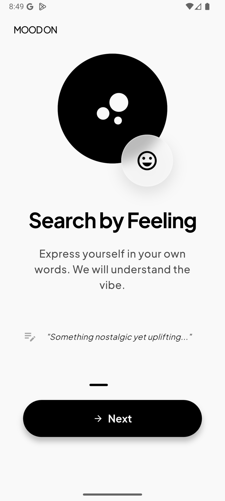
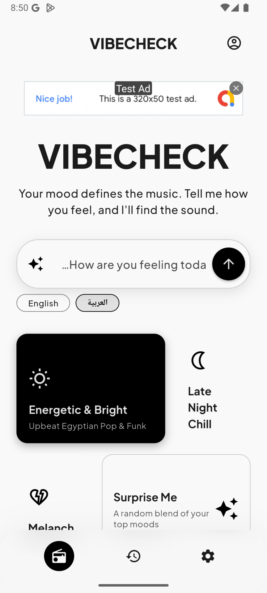
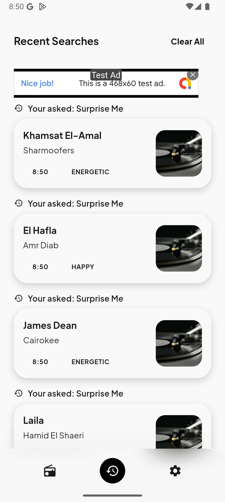
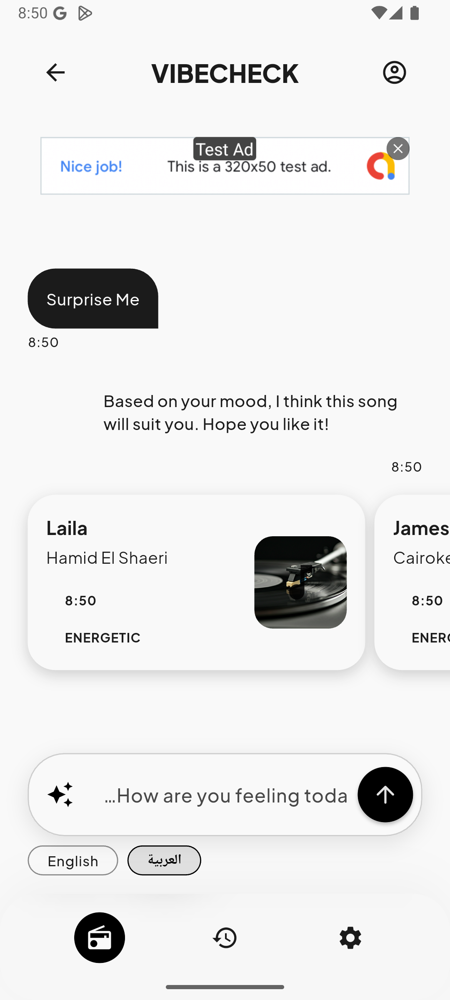
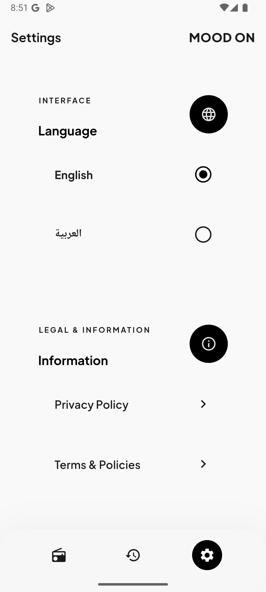

# 🎵 Mood-On: Your AI-Powered Mood & Music Companion

[](https://flutter.dev)
[](https://dart.dev)
[](#architecture)
[](LICENSE)

**Mood-On** is a sophisticated, enterprise-grade Flutter application designed to bridge the gap between your emotions and your music library. By leveraging advanced AI and a robust technical foundation, Mood-On understands how you feel and provides the perfect soundtrack for every moment.

---

## 🚀 Project Overview

Mood-On is not just a music recommender; it's an emotional companion. It tracks your mood history, offers AI-driven conversations to help you process feelings, and curates music suggestions that resonate with your current state. Whether you're feeling on top of the world or need a little pick-me-up, Mood-On is there to sync with your vibe.

---

## 🛠 Tech Stack

The project is built using a modern and scalable tech stack tailored for high performance and maintainability.

*   **UI Framework:** [Flutter](https://flutter.dev) (Latest Stable)
*   **State Management:** [Flutter Bloc (Cubit)](https://pub.dev/packages/flutter_bloc) with **MVI Pattern**
*   **Networking:** [Dio](https://pub.dev/packages/dio) & [Retrofit](https://pub.dev/packages/retrofit)
*   **Dependency Injection:** [GetIt](https://pub.dev/packages/get_it) & [Injectable](https://pub.dev/packages/injectable)
*   **Local Database:** [ObjectBox](https://pub.dev/packages/objectbox) (NoSQL High-Speed Database)
*   **Routing:** [GoRouter](https://pub.dev/packages/go_router)
*   **AI Integration:** [Firebase AI (Gemini)](https://firebase.google.com/docs/vertex-ai)
*   **Design System:** Custom Tokens with [Plus Jakarta Sans](https://fonts.google.com/specimen/Plus+Jakarta+Sans) Typography
*   **Animations:** [Flutter SpinKit](https://pub.dev/packages/flutter_spinkit) & Custom Micro-animations
*   **Analytics & Monitoring:** Firebase Analytics & Crashlytics

---

## 🏗 Architecture

Mood-On adheres to a **Strict Clean Architecture** combined with the **MVI (Model-View-Intent)** pattern. This ensures the codebase is highly testable, decoupled, and easy to scale.

### The 4 Pillars of Our Architecture:

1.  **Domain Layer (Pure Dart):** Contains business logic, Entities, Use Cases, and Repository Interfaces. It has zero dependencies on Flutter or external libraries.
2.  **Data Layer:** Defines the structure of the data layer, including Repository implementations and Data Source interfaces.
3.  **API Layer:** The implementation detail of the Data layer. It handles network clients (Retrofit/Dio), Remote/Local Data Source implementations, and API Models (@JsonSerializable).
4.  **Presentation Layer (MVI):** Organized by feature. Contains Screens, ViewBodies (UI Sections), and ViewModels (Cubits) that process Intents and emit Immutable States.
5.  **Core Layer:** The backbone of the app. Contains DI configuration, Routing, Theme data, Localization, Extensions, and shared UI components.

---

## ✨ Key Features

*   🧠 **AI Mood Detection:** Intelligent analysis of your input to determine your emotional state.
*   🎵 **Personalized Recommendations:** Song suggestions tailored specifically to your detected mood.
*   📊 **Emotional Insights:** Track your mood trends over days, weeks, and months with local history.
*   💬 **AI Companion Chat:** A safe space to talk about your day and get empathetic responses.
*   🌍 **Contextual Awareness:** Location-based suggestions (e.g., chill vibes for a rainy day in London).
*   🌓 **Premium UI/UX:** Stunning dark-themed design with glassmorphism and smooth transitions.
*   🌐 **Multi-language Support:** Fully localized in **English** and **Arabic** (RTL support).
*   📦 **Offline First:** All your history and preferences are stored locally using ObjectBox for instant access.

---

## 📂 Folder Structure

```text
lib/
 ├── api/               # Data Source Impls, API Models, & Network Clients
 ├── core/              # Design System, DI, Router, Utils, Extensions
 ├── data/              # Repository Impls & Data Source Interfaces
 ├── domain/            # Entities, Use Cases, Repository Interfaces
 ├── l10n/              # Localization (ARB files)
 ├── local/             # Local Database setup (ObjectBox)
 ├── presentation/      # UI Features (Screens, ViewModels, Widgets)
 │     ├── home/
 │     ├── history/
 │     ├── profile/
 │     └── ...
 └── main.dart          # Entry point & App Initialization
```

---

## 🏃 How to Run

1.  **Clone the repository:**
    ```bash
    git clone https://github.com/your-username/mood-on-app.git
    ```
2.  **Install dependencies:**
    ```bash
    flutter pub get
    ```
3.  **Generate code (Build Runner):**
    ```bash
    dart run build_runner build --delete-conflicting-outputs
    ```
4.  **Setup Firebase:**
    Ensure you have your `google-services.json` (Android) and `GoogleService-Info.plist` (iOS) in the respective folders.
5.  **Run the app:**
    ```bash
    flutter run
    ```

---

## 📸 Screenshots

| Onboarding | Home & Mood | Mood History |
| :---: | :---: | :---: |
|  |  |  |

| AI Chat Companion | App Settings | Multi-language |
| :---: | :---: | :---: |
|  |  |  |

---

## 🤝 Contributors

- [Moaz Osama](https://github.com/moazosama1)
- [Mohamed Hossam El-Bably](https://github.com/Bablu521)
- [Anas Hany](https://github.com/anashany-shift)
- [Youssef Mohamed](https://github.com/youssefmdev22)

---

<p align="center">Built with ❤️ by the Flutter.</p>
